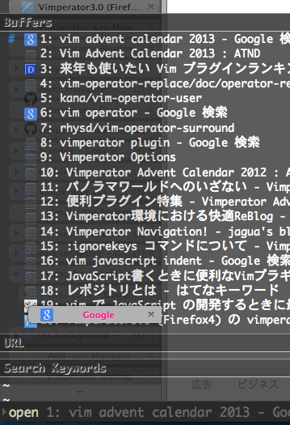
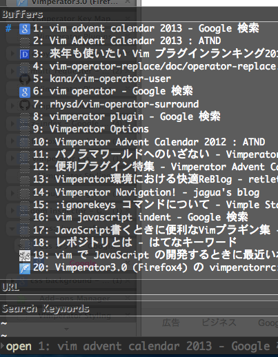

vimperator と ツリー型タブ は便利で使ってたのだが、
先日、表示がおかしくなってることに気づいた。

こんな感じ。



コマンドラインの補完部分に、タブ表示が覆い被さっている。

修正するには、 .vimperatorrc に、以下を記載したら出来た。

```vim
style! -name=treestyletab chrome://* .tabbrowser-tab { z-index: 0 !important; }
```

style コマンドで、既存のcssを書き換えることが出来るみたい。 詳細は、
`:h style` 。

修正後はこんな感じ。



ツリー型タブのcssのクラス名とかを調べるには、 [DOM Inspector :: Add-ons for Firefox](https://addons.mozilla.org/ja/firefox/addon/dom-inspector-6622/)
を使用した。

使い方は、 [Dom Inspectorでブックマークサイドバーを開くコマンドを見つける](http://diary.noasobi.net/junk/DOMInspector.html)
がすごい参考になった。
