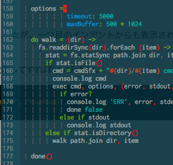
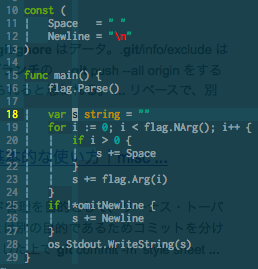

vim には、見やすい定番のインデントプラグインとして、
[nathanaelkane/vim-indent-guides](https://github.com/nathanaelkane/vim-indent-guides)
がある。

しかし、最近、
[Yggdroot/indentLine](https://github.com/Yggdroot/indentLine)
というプラグイン が、 [オススメなVimのプラグイン紹介 - RailsとRubyとVimのブログ](http://alpaca.tc/blog/vim/plugins-best-of-vim-1.html)
で紹介されていたので、乗り換えた。



シンプルでかっこいい。 それに、 vim-indent-guides は、 indent
をタブで記述してあるファイルの時の表示がタブ全部が色塗られてしまって見難い。

個人的にはタブを使用することはなくて、スペースを使用するから問題ないのだけれども・・・。

その点、 [indentLine](https://github.com/Yggdroot/indentLine)
では、スペースしか対応してなく、タブの場合は何もしない。

README にも記載があるが、タブで同じことやるためには、 .vimrc
に、以下の記載を加えればいい。

```vim
set list listchars=tab:\¦\
```

最後にスペースが入っていることに注意。

こうすると、スペースの場合とほぼ同じように表示される。



ただ、一つ目のインデントからも表示されるのが不満。2行目からのみ表示されるように出来ないものか・・・。

また、インデントを除外したい場合は、その filetype
を設定してやればいいみたい。

```vim
let g:indentLine_fileTypeExclude = ['help', 'nerdtree', 'calendar', 'thumbnail', 'tweetvim']
```

こんな感じ。

