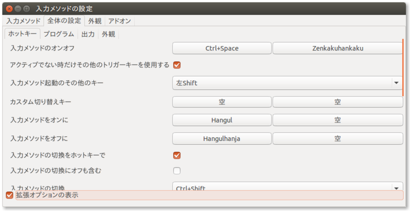

vimを使っていて困るのがIMEの制御。特に、ノーマルモードに戻った時に自動でIMEがOFFになってくれないと、画面に「jっっっｘ」とかがあふれる。
Macでは、「karabiner」というソフトを使って、「Escape」もしくは、「Ctrl + [」を押下した時に自動でIMEをOFFにすることが出来ていた。

Linuxでも同じことが出来ないかといろいろググってはみたものの、意外とこれ！ってのが見つからない。
そんな中、一応要望を満たせるのが、「Mayu」というソフトだった。

Windowsで「窓使いの憂鬱」と呼ばれてたソフトで、Linuxにも対応してるっぽい。

設定自体は単純なんだけど、キーボードのキーコードを全部定義しなきゃいけないみたいで、それがめんどくさそうだった。
幸いにも、全部をスキャンしたファイルをアップしてくれている人がいたので、使用させてもらった。
一部、MacBookAirのキーコードに対応していなかったものがあったため、少し改変している。

### Mayuのインストール

Mayuはソースコードのみ配布されているので、自分でビルドする必要がある。
Ubuntu 15.04では以下の通りにやるとビルド出来た。
```sh
$ ghq get https://github.com/kenhys/mayu.git
$ cd ~/.ghq/src/github.com/kenhys/mayu
$ sudo aptitude install build-essential libboost-iostreams-dev libudev-dev libusb-1.0-0-dev
$ ./configure --with-boost-libdir=/usr/lib/x86_64-linux-gnu/
$ make
$ sudo make install
$ sudo chmod +s /usr/local/bin/mayu
```

mayuはroot権限で実行する必要があり、systemd経由で自動起動させるためにsetuidをたてている。
本当はvisudoとかでmayuのみパスワードなしsudo出来るようにしたりとかのがいいのかもしれないけど、めんどくさいので・・・。

### fcitx設定

今回やりたいのは、「Escape」を押下した時にIMEをオフにする、もしくは「Crtl-[」を押下した時にIMEをオフにするということ。
前提として、Ubuntu 15.04では、IMEとしてfcitx-mozcを使用している。

それから、fcitxの設定で、「入力メソッドをオンに」を「Hangul」(かなキー)、入力メソッドをオフ」に「Hangulhanja」(英数キー)を割り当てる。



### Mayu設定

次に、mayuの設定を書く。上記のようにfcitxの設定をしているのであれば、mayuの設定としては以下の通り。

```sh
def key Esc Escape = 0x01
def key Eisu = 0x7b

key Esc = Esc Eisu
key C-OpenBracket = C-OpenBracket Eisu
```

「Escape」が押された時に、「Escape」、「英数」を押し、「Ctrl-[」が押された時に、「Ctrl-[」、「英数」を押すという設定。

ただ、mayuでは、一通りキーボード上のキーは全てdefしなきゃいけないみたいで、ネット上に公開してくださっているありがたい方の [キーコード一覧](http://d.hatena.ne.jp/OKIIZO/20080106/1199639459) を使用させてもらった。

一部、MacBookAirのキーコードと違う部分があったので、改変している。 [mayu](https://raw.githubusercontent.com/yukimemi/dotfiles/master/.mayu)

この設定ファイルをHOMEに「.mayu」として置く。
その後、mayuをルート権限で実行する。

これでvim上でもシェル上でも、どこでも同じようにIMEがオフになるようになる。

あと、キーボードでキーコード一覧に記載されていないものがあった場合、mayuの標準出力にキーコードが表示される。それをメモして、設定ファイルに適当な名前で「def key hoge = 0xXX」とかしてやれば大丈夫。

### Mayu自動起動

システム起動時に自動でmayuが起動するように、systemdに登録する。

userごとの自動起動設定としたいため、以下のファイルをまず作成する。

```sh
$ mkdir -p ~/.config/systemd/user
$ vim ~/.config/systemd/user/mayu.service
```

「mayu.service」の中身はこんな感じ
```sh
[Unit]
Description=mayu keyboard hack

[Service]
ExecStart=/usr/local/bin/mayu

[Install]
WantedBy=default.target
```

それから、以下のようにして登録する。

```sh
$ systemctl --user daemon-reload
$ systemctl --user list-unit-files
UNIT FILE            STATE
mayu.service         disabled
systemd-exit.service static
basic.target         static
bluetooth.target     static
default.target       static
exit.target          disabled
paths.target         static
printer.target       static
shutdown.target      static
smartcard.target     static
sockets.target       static
sound.target         static
timers.target        static

13 unit files listed.

$ systemctl --user enable mayu.service
$ systemctl --user list-unit-files
UNIT FILE            STATE
mayu.service         enabled
systemd-exit.service static
basic.target         static
bluetooth.target     static
default.target       static
exit.target          disabled
paths.target         static
printer.target       static
shutdown.target      static
smartcard.target     static
sockets.target       static
sound.target         static
timers.target        static

13 unit files listed.
```

systemdとして正しく起動しているか確かめる場合は、ログを見る。

```sh
$ journalctl
5月 02 08:57:56 yukimemi-MacBookAir systemd[1372]: Starting Basic System.
5月 02 08:57:56 yukimemi-MacBookAir systemd[1372]: Started mayu keyboard hack.
5月 02 08:57:56 yukimemi-MacBookAir systemd[1372]: Starting mayu keyboard hack...
5月 02 08:57:56 yukimemi-MacBookAir systemd[1372]: Reached target Default.
5月 02 08:57:56 yukimemi-MacBookAir systemd[1372]: Startup finished in 44ms.
5月 02 08:57:56 yukimemi-MacBookAir systemd[1]: Started User Manager for UID 1000.
5月 02 08:57:56 yukimemi-MacBookAir systemd[1372]: Starting Default.
5月 02 08:57:56 yukimemi-MacBookAir kernel: input: mayu uinpt as /devices/virtual/input/input14
5月 02 08:57:56 yukimemi-MacBookAir mayu[1386]: loading: /home/yukimemi/.mayu
5月 02 08:57:58 yukimemi-MacBookAir mayu[1386]: successfully loaded.
```

こんな感じ。
だいぶ使いやすくなった。

- - -
##### 参考

[systemdでの定期実行(timerユニット) - Qiita](http://qiita.com/sharow/items/e8f7d3e0628d7ee925db)

[新型Apple Keyboard微妙 - どんごどんご](http://d.hatena.ne.jp/OKIIZO/20080106/1199639459)

[kenhys/mayu](https://github.com/kenhys/mayu)

[Ubuntu 14.04にMozcと窓使いの憂鬱をインストールする - Symfoware](http://symfoware.blog68.fc2.com/blog-entry-1397.html)


