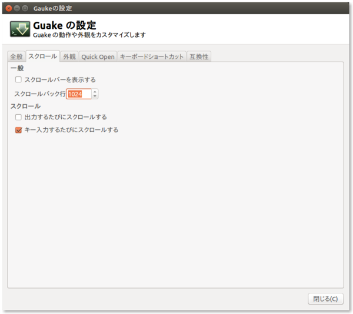

macでiTerm2を使っていたので、同じように使えるterminalがないか探していたところ、あんまこれ！ってのが見つからなかったので、昔使ってたguakeを入れた。けっこう普通につかえて便利。

```sh
$ sudo apt-get install guake
```

デフォルトでは、「F12」で起動する。

おすすめ設定は、こんな感じ。

* 全般


* スクロール



* 外観


タブバーを表示しないようにして、start fullscreenにして、スクロールバーを非表示にして、透明度を下から2個目くらいにしたらちょうどいい感じ。


あとは、fontをRicty for Powerlineにする。

Ricty for Powerlineのインストールは以下の通り。

```sh
#!/bin/bash
mkdir -p ~/tmp
mkdir -p ~/.fonts
pushd ~/tmp

sudo apt-get install fontforge

wget http://levien.com/type/myfonts/Inconsolata.otf
wget http://iij.dl.sourceforge.jp/mix-mplus-ipa/59022/migu-1m-20130617.zip

unzip migu-1m-20130617.zip

git clone https://github.com/yascentur/Ricty.git

pushd Ricty

./ricty_generator.sh ~/tmp/Inconsolata.otf ~/tmp/migu-1m-20130617/migu-1m-regular.ttf ~/tmp/migu-1m-20130617/migu-1m-bold.ttf

mv Ricty*.ttf ~/.fonts

popd

git clone https://github.com/Lokaltog/vim-powerline.git
fontforge -lang=py -script ./vim-powerline/fontpatcher/fontpatcher $HOME/.fonts/Ricty-Regular.ttf
fontforge -lang=py -script ./vim-powerline/fontpatcher/fontpatcher $HOME/.fonts/Ricty-Bold.ttf
mv Ricty-Regular-Powerline.ttf ~/.fonts
mv Ricty-Bold-Powerline.ttf ~/.fonts

popd

fc-cache -vf
```

これでかなり良くなる。
あとは、色を設定する。iTerm2でもテーマがあったように、guakeでも、ネットにテーマを作ってくださっているありがたい方がいらっしゃるので、使用させてもらう。

```sh
$ ghq get https://github.com/coolwanglu/guake-colors-solarized.git
$ ghq get https://github.com/erroneousboat/guake-colors-monokai.git
```
有名なsolarizedとmonokaiのテーマ。
適用は、どちらもシェルスクリプトを実行するだけ。

```sh
$ cd guake-colors-solarized
$ ./set_dark.sh
```

もしくは、

```sh
$ cd guake-colors-monokai
$ ./setup.sh
```

一瞬で変わる。べんり。

あとは、なぜかtmuxが256-color表示出来ていなかった。これは、オプションを指定して起動すればいいみたい。

```sh
$ tmux -2
```

それから、guake上で実行したvimの背景が透過されていなかった。
こちらは、.vimrcに以下を追加して解決。

```vim
highlight Normal ctermbg=none
```

- - -

##### 参考
[Ubuntu on Let's Note vimの背景を半透明にする](http://uonl.tumblr.com/post/53433544404)

[Getting 256 colors to work in tmux - Unix & Linux Stack Exchange](http://unix.stackexchange.com/questions/1045/getting-256-colors-to-work-in-tmux)


