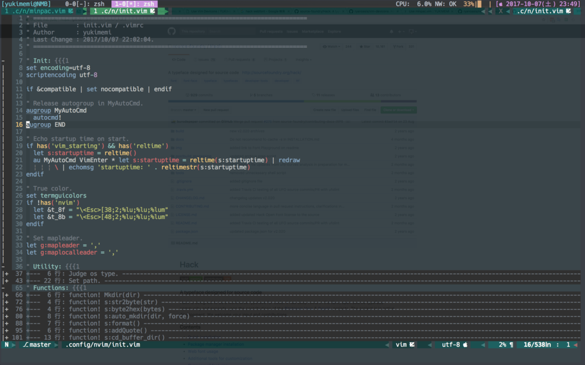

[vim-devicons](https://github.com/ryanoasis/vim-devicons) という、 [atom](https://atom.io/) であるようなアイコン表示できるやつがあるみたいなので使ってみた。

ついでに、前から気になっていた、 [vim-airline](https://github.com/vim-airline/vim-airline) も試してみた。

- - -

### パッチ済みフォントのインストール

[vim-devicons](https://github.com/ryanoasis/vim-devicons) を使用するには、まず、パッチ済みフォント ( [nerd-fonts](https://github.com/ryanoasis/nerd-fonts) ) をインストールする必要がある。

mac の場合は、 [homebrew](https://brew.sh/index_ja.html) があるから簡単にインストールできる。

```sh
$ brew tap caskroom/fonts
$ brew cask install font-hack-nerd-font
```

それから、 iTerm2 の設定から、インストールされた、 `Knack Nerd Font` を選択する。

### Neovim の設定

neovim の設定を追加する。
[以前の投稿](http://yukimemi.github.io/post/2017-09-17_use-minpac.vim/) と同様に、 [k-takata/minpac](https://github.com/k-takata/minpac) を使用した、遅延ロードで設定をした。

こんな感じ。(一部[だいぶ] 省略)

```vim
let s:start_plugs = [
      \ ['tpope/vim-fugitive', {}],
      \ ['vim-airline/vim-airline', {}],
      \ ['vim-airline/vim-airline-themes', {}],
      \ ['ryanoasis/vim-devicons', {}],
      \ ]

" vim-airline settings.
let g:airline_powerline_fonts = 1
let g:airline_detect_iminsert = 1
let g:airline_symbols_ascii = 0
let g:airline_mode_map = {
      \ '__' : '-',
      \ 'n'  : 'N',
      \ 'i'  : 'I',
      \ 'R'  : 'R',
      \ 'c'  : 'C',
      \ 'v'  : 'V',
      \ 'V'  : 'V',
      \ '' : 'V',
      \ 's'  : 'S',
      \ 'S'  : 'S',
      \ '' : 'S',
      \ }

if !exists('g:airline_symbols')
  let g:airline_symbols = {}
endif

" powerline symbols
let g:airline_left_sep = ''
let g:airline_left_alt_sep = ''
let g:airline_right_sep = ''
let g:airline_right_alt_sep = ''
let g:airline_symbols.branch = ''
let g:airline_symbols.readonly = ''
let g:airline_symbols.linenr = '☰'
let g:airline_symbols.maxlinenr = ''

" unicode symbols
let g:airline_left_sep = '»'
let g:airline_left_sep = '▶'
let g:airline_right_sep = '«'
let g:airline_right_sep = '◀'
let g:airline_symbols.crypt = '🔒'
let g:airline_symbols.linenr = '☰'
let g:airline_symbols.linenr = '␊'
let g:airline_symbols.linenr = '␤'
let g:airline_symbols.linenr = '¶'
let g:airline_symbols.maxlinenr = ''
let g:airline_symbols.maxlinenr = '㏑'
let g:airline_symbols.branch = '⎇'
let g:airline_symbols.paste = 'ρ'
let g:airline_symbols.paste = 'Þ'
let g:airline_symbols.paste = '∥'
let g:airline_symbols.spell = 'Ꞩ'
let g:airline_symbols.notexists = '∄'
let g:airline_symbols.whitespace = 'Ξ'

" extensions
let g:airline#extensions#tabline#enabled = 1
let g:airline#extensions#tabline#switch_buffers_and_tabs = 1

" theme
let g:airline_theme = 'luna'
```

こんな感じ。



うーん、微妙かも・・・。


