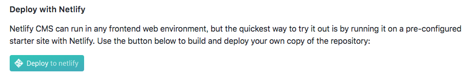

[GatsbyJS](https://www.gatsbyjs.org/) を使ってみようと思う。

starter kit にいろんなのが指定できるみたいで、 [alxshelepenok/gatsby-starter-lumen](https://github.com/alxshelepenok/gatsby-starter-lumen) を使ってみた。

[Netlify](https://www.netlify.com/) にアカウントを作っていたら、
README にあるように、 **Deploy to netlify** のボタンを押せば簡単に github にリポジトリ作ってくれた。めちゃかんたん。

あとは、作られたリポジトリをダウンロードして、ちょこちょこ設定系を変更したらいい感じにできた。

とりあえず、 **Hugo** で作成していた過去の記事も持ってきたいなーと思ったので一括置換した。 (参考リンク参照)

後はもうちょっと **tags** とか、 **description** とか、 **category** とかちゃんとしたいけど、とりあえずそれはおいおい・・・。

後は share ボタンも追加したいなぁ・・・。

---

#### 参考

[ブログを Gatsby に移行しました - とりあえず動かすところまで | tmnm.tech](https://tmnm.tech/2017/09/10/migrate-to-gatsby/)
