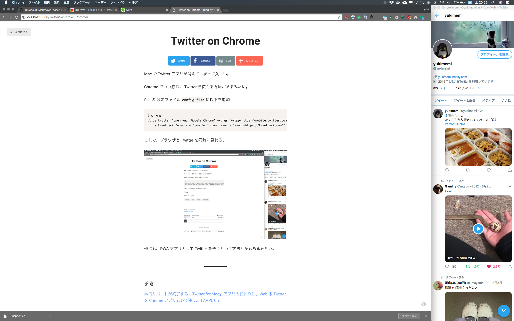

Mac で Twitter アプリが消えてしまって久しい。

Chrome でいい感じに Twitter を使える方法があるみたい。

fish の 設定ファイル `config.fish` に以下を追加

```fish
# chrome
alias twitter "open -na 'Google Chrome' --args '--app=https://mobile.twitter.com'"
alias tweetdeck "open -na 'Google Chrome' --args '--app=https://tweetdeck.com'"
```

これで、ブラウザと Twitter を同時に見れる。



他にも、PWA アプリとして Twitter を使うという方法とかもあるみたい。

---

## 参考

[本日サポートが終了する「Twitter for Mac」アプリの代わりに、Web 版 Twitter を Chrome アプリとして使う。 | AAPL Ch.](https://applech2.com/archives/20180316-twitter-for-mobile-alternate-for-mac.html)
